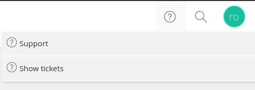

<!-- Autogenerated from composer.json - All changes will be overridden if generated again! -->

# HelpMe ILIAS Plugin

HelpMe

This project is licensed under the GPL-3.0-only license

## Requirements

* ILIAS 6.0 - 7.999
* PHP >=7.2

## Installation

Start at your ILIAS root directory

```bash
mkdir -p Customizing/global/plugins/Services/UIComponent/UserInterfaceHook
cd Customizing/global/plugins/Services/UIComponent/UserInterfaceHook
git clone https://github.com/fluxapps/HelpMe.git HelpMe
```

Update, activate and config the plugin in the ILIAS Plugin Administration

## Description

If you want to use the show tickets feature, you need to install the [HelpMeCron](https://github.com/fluxapps/HelpMeCron) plugin

If yout want use the Jira recipient with oAuth authorization you can find a guide to config your Jira installation: https://developer.atlassian.com/cloud/jira/platform/jira-rest-api-oauth-authentication/

You can lock errors in the ILIAS log file like

```bash
grep HelpMe /var/iliasdata/ilias/ilias.log
```

Support button:


Support button with enabled show tickets:


Support UI:


Show tickets UI:


Config:


Config projects table:


Config project:


## Notifications config

You have a `support` property (See more in [Class Support](./src/Support/Support.php)) for specific fields in both subject and body.

In body you have also a `fields` (Array of [Class SupportField](src/Support/SupportField.php)) for dynamic fields.

It uses the twig tempate engine (See more at https://twig.symfony.com/doc/1.x/templates.html).

So you can either use a for loop to fill the notification body dynamic like:

```html
<p>	<h2>{{ field.label |e }}</h2>	{{ field.value |e }}</p><br>
```

or fill only specific support fields like:

```html
<h1>{{ support.title |e }}</h1><p>{{ support.description |e }}</p>
<small>{{ support.page_reference |e }}</small>
```

or both mixed like:

```html
<p>	<h2>{{ field.label |e }}</h2>	{{ field.value |e }}</p><br>
<small>{{ support.page_reference |e }}</small>
```

Note: For safety reasons Jira API does not supports HTML and will escape HTML
